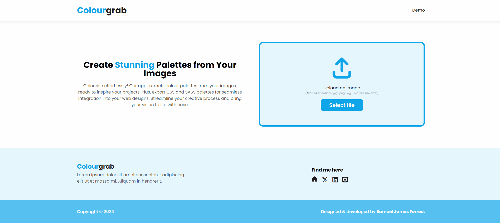

# ColourGrab

ColourGrab is an app, built in Flask, that takes user uploaded images, extracts the colours from these images, and uses them to generate exportable colour palettes.

Currently, the app supports the following palette types:

-   RGB values
-   CSS variables
-   SASS variables
-   Tailwind themes

I find myself constantly inspired by colourful imagery; whether it be photographs, illustrations, or anything else. Colourgrab was born out of the idea to make these colours easily convertible into digital colour palettes.

## Table of Contents

-   [Change Log](#change-log)
-   [Setup](#setup)
    -   [Set Environment Variables](#set-environment-variables)
    -   [Virtual Environment, Dependencies, and Server](#virtual-environment-dependencies-and-server)
    -   [Build Frontend](#build-frontend)
-   [Technologies](#technologies)
    -   [Languages](#languages)
    -   [Frameworks/Pre-processors](#frameworkspre-processors)
    -   [Libraries](#libraries)
    -   [Design](#design)
    -   [Misc](#misc)
-   [Testing](#testing)
-   [Credits](#credits)

## Change Log

All changes (features, bugs, etc.) following the initial launch of this app can be found in this project's [issues tab](https://github.com/SamuelJForrest/colourgrab-v2/issues).

## Setup

### Set Environment Variables

This project using the following environment variables, which would be included in a `.env` file at the root directory of the project:

-   `DEVELOPMENT` (bool): Toggles debug mode on/off
-   `PORT` (int): The port that you want your local server to run the app on
-   `SECRET_KEY` (str): A randomly generated string, this can be anything.
-   `UPLOAD_FOLDER` (str): The path to your uploads folder (often found within 'static')

### Virtual Environment, Dependencies, and Server

**NOTE**: The following instructions assume that you are in the root directory of the project.

-   Create a virtual environment through a method of your choice. If you are unsure how to do this, run the following command: `python -m venv .venv`. This will create a virtual environment called `.venv`
-   Activate your virtual environment. If you created a virtual environment by running the command in the previous step, now run one of the following commands:
    -   Windows: `.venv\Scripts\activate`
    -   Unix: `source .venv\bin\activate`
-   With your virtual environment running, install the dependencies by running: `pip install -r requirements.txt`
-   Finally, run `python3 app.py` to start the server.

### Build Frontend

-   Before starting, ensure you have the correct version of Node installed, this can be found in the `.nvmrc` file in the root directory (`v21.6.2`).
-   Once you have installed the correct version of Node, run `npm install` (or `npm i`) to install `node_modules`
-   Finally, run `npm run watch` to compile the CSS/JS. This command will recompile these assets every time a .scss or .js file (within the relevant directories) is saved.

Congratulations, you are now set up!

## Technologies

### Languages

-   [HTML](https://developer.mozilla.org/en-US/docs/Web/HTML)
-   [CSS](https://developer.mozilla.org/en-US/docs/Web/CSS)
-   [JavaScript](https://developer.mozilla.org/en-US/docs/Learn/JavaScript)
-   [Python](https://www.python.org/)

### Frameworks/Pre-processors

-   [SASS/SCSS](https://sass-lang.com/)
-   [Bootstrap](https://getbootstrap.com/)
-   [Flask](https://flask.palletsprojects.com/en/3.0.x/)

### Libraries

-   [Jest](https://jestjs.io/): for frontend testing.
-   [a11y Dialog](https://a11y-dialog.netlify.app/): for accessible modal dialogs.
-   [copy-to-clipboard](https://www.npmjs.com/package/copy-to-clipboard): for copying colour palettes to user's clipboard.
-   [Pytest](https://docs.pytest.org/en/8.0.x/): for backend testing.
-   [colorgram](https://pypi.org/project/colorgram.py/): this package is used to extract the colours from user uploaded images.

### Design

-   [Figma](https://figma.com)

### Misc

-   [NVM](https://github.com/nvm-sh/nvm)
-   [Webpack](https://webpack.js.org/)

## Testing

## Credits

-   Thanks to the [Pqina Blog](https://pqina.nl/blog/compress-image-before-upload/#saving-the-compressed-image-back-to-the-file-input) for their article on compressing images using JavaScript.
